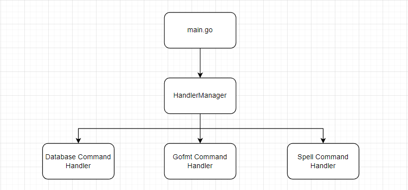

# Домашнее задание

## Задача
- Внедрить в проект функционал консольных команд так, чтобы при добавлении новой команды понадобилось минимум изменений
- Добавить команду help, которая выводит информацию обо всех имеющихся консольных командах 
- Добавить команду spell с единственным аргументом - словом на английском языке
- Команда spell принимает на вход слово, а по результатам работы выводит в консоль все буквы этого слова через пробел
- 💎 Реализовать команду - сильно упрощенный gofmt. На выход принимает *.txt файл, на выходе перед каждым абзацем вставляет таб и ставит точку в конце предложений

## Решение 

### 1. Обработчик консольных команд

За основу проекта взято решение домашней работы №5. Структура проекта изменена следующим образом:
```
homework-6
├───cmd
├───internal
│   ├───command_manager
│   ├───handler
│   │   ├───database_command_handler
│   │   ├───gofmt_command_handler
│   │   └───spell_command_handler
│   └───pkg
│       ├───db
│       └───repository
│           └───postgres
├───migrations
└───sql
```

- cmd ― содержит main.go 
- internal/command_manager ― содержит реализацию менеджера обработчиков команд
- internal/handler содержит:
    - handler.go ― интерфейс обработчика
    - database_command_handler ― обработчик команд работы с базой данных
    - gofmt_command_handler ― обработчик команды gofmt
    - spell_command_handler ― обработчик команды spell
- internal/pkg/db содержит:
    - сlient.go ― структуру клиента для взаимодействия с СУБД
    - database.go ― содержит методы для выполнения базовых операций с базой данных используя библиотеку pgx, 
- internal/pkg/repository ― содержит реализацию паттерна репозиторий:
    - struct.go ― содержит структуры таблиц БД
    - repository.go ― содержит интерфейсы для взаимодействия с таблицами
    - postgres ― содержит реализацию интерфейса для взаимодействия с таблицами PostgreSQL
- migrations ― директория с миграциями

Для корректной работы необходимо изменить следующие поля для взаимодействия с СУБД в internal/pkg/db/сlient.go : 
```
  host     = <host>
  port     = <port>
  user     = <user name>
  password = <password>
  dbname   = <database name>
```

Далее, можно выполнить запуск проекта с помощью команды
```
go run cmd/main.go
```

### 2. Как добавить новый обработчик?


Команды, которые можно выполнить в рамках текущего проекта делятся по типу применения и обрабатываются соответствующим обработчиком, к примеру, проект поддерживает множество команд для работы с базой данных ― эти команды обрабатываются DatabaseCommandHandler'ом

Для корректной работы всех обработчиков есть менеджер обработчиков. Для того, чтобы создать менеджер, необходимо передать ему переменные структур, которые реализуют интерфейс Handler

В данный момент это выглядит следующим образом:



Если вы хотите добавить команду, которая относится к области применения уже реализованного обработчика, необходимо добавить логику обработки этой команды в конкретный обработчик

Если ваша команда не относится ни к одной области применения уже существующих обработчиков или вы хотите добавить обработку нескольких команд одной области применения, вам необходимо:

1. Внутри директории handler создать новый пакет, который будет содержать реализацию вашего обработчика
2. Внутри пакета имплементировать ваш обработчик, который будет удовлетворять интерфейсу Handler:

```
type Handler interface {
	GetListOfCommands() []string
	IsMyCommand(command string) bool
	HandleCommand(command string)
	GetGoalOfHandler() string
}
```
3. Инициализировать ваш обработчик и добавить его в менеджер обработчиков, как это сделано в main.go

